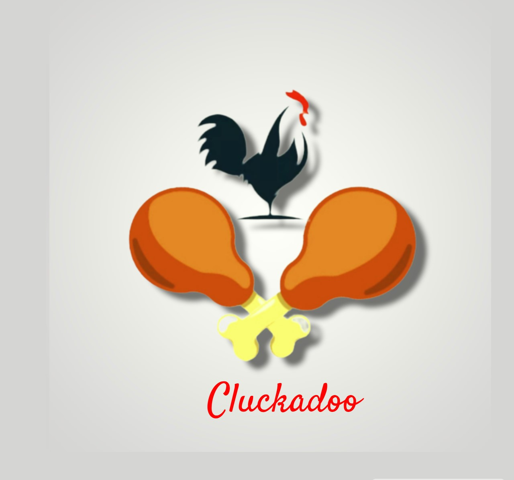

# KFC Clone

 KFC (Kentucky Fried Chicken) is a fast-food restaurant chain that specializes in fried chicken. The company was founded in 1930 by Harland Sanders, who developed a secret blend of 11 herbs and spices for the chicken that is still used today.

KFC is known for its menu items such as Original Recipe chicken, Extra Crispy chicken, and various sides such as mashed potatoes, coleslaw, and biscuits. KFC operates in over 140 countries and territories around the world, making it one of the largest fast-food chains in the world.

## Renamed as :

# Cluckadoo 

## Website Logo :

  

# KFC Clone
This is a clone of Kentucky Fried Chicken web App, made by me for Final Year College Project 
## Technologies Used
- HTML
- CSS
- JavaScript
-
## Features
- Responsive design for desktop and mobile devices
- User authentication and registration
- Product details page with images, descriptions, and reviews
- Shopping cart and checkout system
- Order history and tracking
-Payment Getway System
 

## Hoisting 
 you can serch clukadoo.netlify.app in browser  , you will  see CKD site 
 
 or 
   
 
## Installation
To install and run this project on your local machine, follow these steps:
1. Clone the repository using `git clone [REPO URL]`
2. Open the project directory in a code editor
3. Install dependencies using `npm install`
4. Start the development server using `npm start`
5. Open your web browser and go to `http://localhost:4500`

or simply open CMD type git clone 'repo Url' - if you used git 

## Acknowledgments
This project was inspired by the KFC website. Thanks to KFC for providing inspiration for this project.

## Contributing

If you would like to contribute to this project, please submit a pull request with your changes. However, please note that this project is intended for personal use and may not be actively maintained

